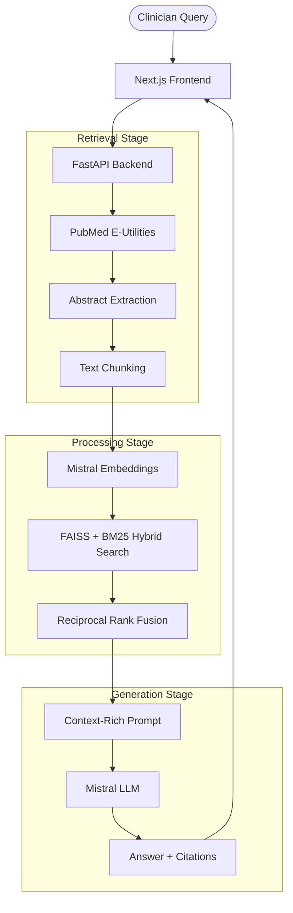

# 🩺 Jubilant AI: Medical Research Assistant

An AI-powered medical research assistant designed for clinicians and researchers. It provides evidence-grounded answers by combining real-time **PubMed** retrieval with a **Retrieval-Augmented Generation (RAG)** pipeline.

> **⚠️ Disclaimer:** This tool is for research support only. It is not intended for emergency care, clinical diagnosis, or personal treatment decisions.

**Live Demo:** [https://medi-chat-an1i.vercel.app/](https://medi-chat-an1i.vercel.app/)

---

## 🚀 Key Features

- **Live PubMed Integration:** Fetches the latest peer-reviewed abstracts directly from the National Library of Medicine.
- **Hybrid Retrieval:** Combines FAISS semantic search (cosine similarity via Mistral embeddings) and BM25 sparse keyword search for robust evidence gathering.
- **Memory Optimized (Render-Ready):** Employs Reciprocal Rank Fusion (RRF) for fast, accurate ranking without heavy local neural networks, ensuring <512MB RAM usage.
- **RAG Pipeline:** Generates structured answers using **Mistral AI** (`mistral-large-latest`) with direct citations.
- **Medical Safety Guardrails:** Built-in checks for emergency keywords, query quality validation, and clinical confidence thresholds.
- **Modern UI:** Responsive dashboard built with Next.js, Tailwind CSS, and Shadcn UI.

---

## 🏗️ Architecture


The system follows a modular RAG architecture to ensure data freshness and clinical relevance:



---

## 🛠️ Project Structure

```text
jubilant_ai/
├── frontend/          # Next.js + Tailwind + shadcn/ui
│   ├── src/app/       # Page layouts and routing
│   ├── src/components # UI components (Chat, Response cards)
│   └── src/lib        # API client and utilities
├── backend/           # FastAPI + RAG Logic
│   ├── app/           # API routes, config, and rate limiting
│   ├── rag/           # Vector store, LLM integration, and scoring
│   ├── services/      # PubMed API, embeddings, and safety guardrails
│   └── models/        # Pydantic schemas for validation
└── docs/              # Sample queries and documentation
```

---

## 🚦 Getting Started

### Prerequisites
- Python 3.11+
- Node.js 20+
- API Keys: [Mistral AI](https://console.mistral.ai/)

### 1. Backend Setup
```bash
cd backend
python -m venv .venv

# Activate Virtual Env (Windows)
.venv\Scripts\activate

# Install Dependencies
pip install -r requirements.txt

# Configure Environment
cp .env.example .env
# Edit .env and set your MISTRAL_API_KEY
```

**Run Backend:**
```bash
# Windows PowerShell
$env:PYTHONPATH="."
uvicorn app.main:app --reload --host 0.0.0.0 --port 8080
```
*API will be available at [http://localhost:8080/docs](http://localhost:8080/docs)*

### 2. Frontend Setup
```bash
cd frontend
npm install

# Configure Environment
cp .env.example .env.local
# Ensure NEXT_PUBLIC_API_URL=http://localhost:8080
```

**Run Frontend:**
```bash
npm run dev
```
*UI will be available at [http://localhost:3000](http://localhost:3000)*

---

## 📖 Usage Examples

Try these queries to see the assistant in action:
- *"What is the efficacy of SGLT2 inhibitors in heart failure with preserved ejection fraction?"*
- *"Recent RCT evidence for first-line antihypertensive therapy in adults under 55"*
- *"Meta-analysis evidence for metformin in gestational diabetes"*

---

## 🛡️ Safety & Reliability

- **Confidence Scoring:** Every response includes a confidence score based on the relevance of the retrieved evidence.
- **Source Citations:** Answers are grounded in specific PubMed IDs (PMIDs) with direct links to the original papers.

---

## 🤝 Contributing

Contributions are welcome! Please feel free to submit a Pull Request.

---
*Developed for the intersection of AI and Evidence-Based Medicine.*
